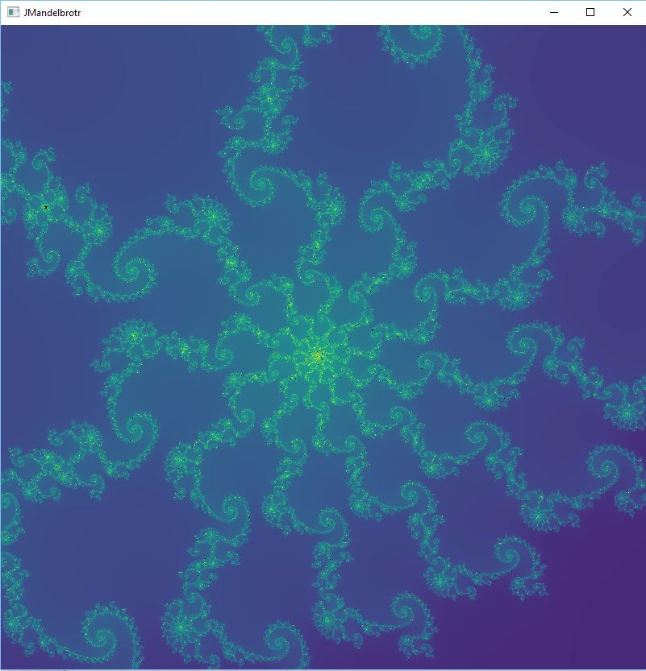

# jmandelbrotr

A Java CUDA (via JCUDA) & OpenGL (via LWJGL) powered Mandelbrot pan/zoom application.  

## Usage

TBD.  I built this via Eclipse.  I don't really know how to properly package Java apps yet.  In the meantime, use the source, Luke!  

## License

Since I cobbled together this code with the help of others, I'll be giving this back to the community.

  
   
  To the extent possible under law,
  <a rel="dct:publisher"
     href="https://github.com/rogerallen/jmandelbrotr">
    Roger Allen</a>
  has waived all copyright and related or neighboring rights to
  JMandelbrotr.
This work is published from:

  United States.

